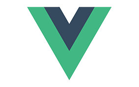

### Sales-App <3

This is a Sales application built with Laravel and VueJS with a CoreUI template.

My intention with this app is that new developers can have a concrete application with Laravel + VueJS where
they can use it as example to learn the right way, implementing the best practices possible and at the same
time learn how TDD is done. So this will be an example application but completely usable for any similar case.

In case you know some good practice appropriate to this app, by all means please send a PR so that new devs 
can start building cools apps as quickly as possible.

- [x] Categories CRUD
- [x] Articles CRUD

#### ToDo's

##### Test Suite:
- [x] Categories Tests
- [] Articles Tests

##### Improvements
- [] Enhance Search functionality in table
- [] Refactor/Recycle Vue Components

#### Installation

- git clone https://github.com/Bcryp7/sales-app.git
- composer install
- npm install
- cp .env.example .env
- php artisan key:generate
- Set DB credentials in .env file
- npm run watch
- php artisan serve
- Learn!